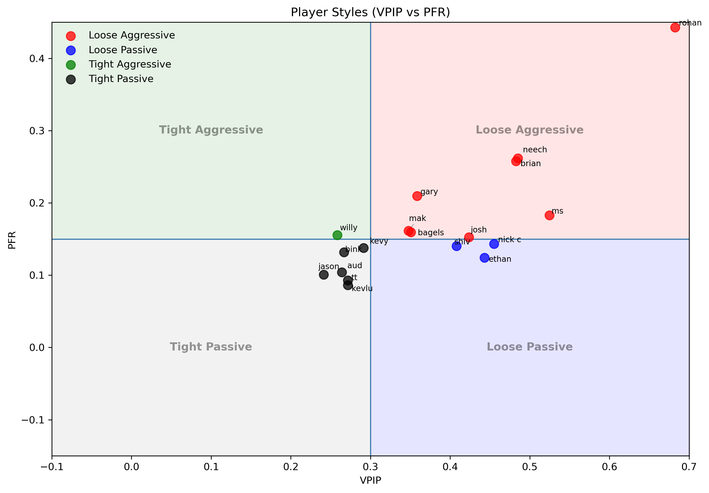

# Poker Player Style Analysis

## Overview

This project builds a full data pipeline to analyze poker hand histories and classify player behavior using industry-standard poker metrics. Starting from raw JSON logs from the Poker Now Website, the project transforms unstructured data into structured tables and computes player-level statistics to understand play style, aggression, and decision-making tendencies.

---

## Key Features

* Built a **data pipeline** to process raw poker hand history JSON files
* Designed structured tables for **actions, players, and hands**
* Implemented core poker analytics metrics used in real gameplay analysis
* Visualized player tendencies through a **style classification map (VPIP vs PFR)**
* Standardized inconsistent player names through a custom cleaning pipeline

---

## Metrics Implemented

* **VPIP (Voluntarily Put Money in Pot)**
  Measures how often a player enters a hand

* **PFR (Preflop Raise Rate)**
  Measures preflop aggression

* **Aggression Factor (AF)**
  Ratio of bets/raises to calls postflop

* **WTSD (Went to Showdown)**
  Frequency of reaching showdown

* **Showdown Win Rate (WSD)**
  Percentage of showdowns won (approximated from action logs)

* **C-Bet Rate**
  Frequency of continuation betting after raising preflop

---

## Key Visualization




### Player Style Map (VPIP vs PFR)

Players are classified into four archetypes:

* Tight Passive
* Tight Aggressive
* Loose Passive
* Loose Aggressive

This provides an intuitive way to compare player tendencies and identify behavioral patterns.


---

## Data Pipeline

1. Load raw JSON hand histories
2. Normalize into structured tables:

   * `actions_df`
   * `players_df`
   * `hand_players_df`
3. Clean and standardize player names
4. Compute player-level metrics using SQL (DuckDB) and Pandas
5. Merge metrics into a final player summary table
6. Generate visualizations

---

## Tech Stack

* **Python**
* **Pandas**
* **DuckDB (SQL analytics)**
* **Matplotlib**

---

## How to Run

1. Install dependencies:

```
pip install -r requirements.txt
```

2. Run the notebook:

```
notebooks/poker_analysis.ipynb
```

---

## Notes

* Player names were normalized to handle inconsistencies across sessions
* Showdown-related metrics are approximations based on available action logs
* Analysis focuses on players with sufficient sample sizes for reliability

---

## Example Insights

- The VPIP–PFR framework clearly separates players into distinct behavioral archetypes (tight/passive, tight/aggressive, loose/passive, loose/aggressive), enabling quick identification of play styles.

- Rohan emerges as a strongly loose-aggressive player, combining high hand participation with consistent preflop pressure. This type of player can often be exploited by playing more selectively and capitalizing on over-aggression.

- Loose-passive players tend to enter many hands but apply little pressure, making them more susceptible to value-heavy and aggressive betting strategies.

- There is significant variation in postflop follow-through, with a ~35 percentage point spread (40%–74%) in c-bet rates. Players with high preflop aggression but low c-bet rates present opportunities for counterplay through tactics like floating or check-raising.

- Secondary metrics such as showdown win rate help distinguish between aggressive but effective play and overly loose strategies.

---

## Data Source & Limitations

The dataset consists of poker hand histories from PokerNow’s game replayer, based on multiple personal gameplay sessions.

The data pipeline is tailored to PokerNow’s JSON schema, so hand histories from other platforms may require adjustments to the parsing logic.

As the dataset reflects a limited player pool, the analysis is intended to demonstrate methodology rather than provide generalizable conclusions.


## Author

Enoch Xiao
